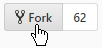
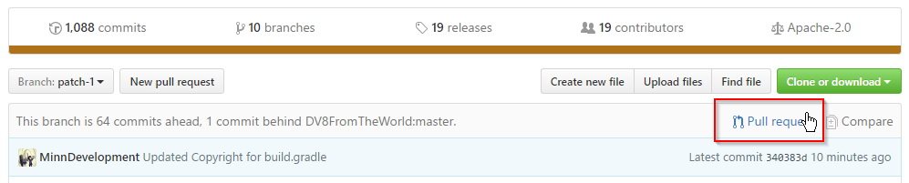
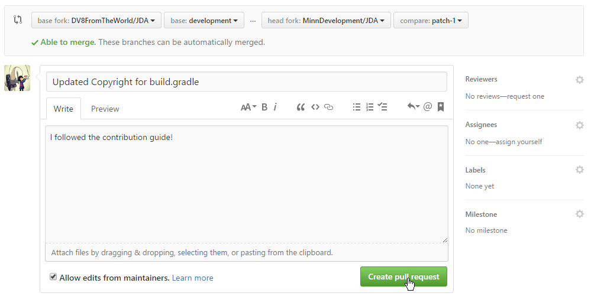

## Setting up your Environment


1. Create a Fork (If you already have a local repository skip to step 3)
    <br>

2. Clone Repository
   
    ```sh
    $ git clone https://github.com/ExampleName/JDA.git # (1)
    Cloning into 'JDA'...
    remote: Counting objects: 15377, done.
    remote: Total 15377 (delta 0), reused 0 (delta 0), pack-reused 15377
    Receiving objects: 100% (15377/15377), 21.64 MiB | 2.36 MiB/s, done.
    Resolving deltas: 100% (8584/8584), done.
    Checking connectivity... done.
    ```
   
    1.  Make sure to replace `ExampleName` with your GitHub Username.

3. Move to your local repository (here `JDA`)
    
    ```sh
    cd JDA
    ```

4. Configure upstream remote to keep your fork updated
    
    ```sh
    $ git remote add upstream https://github.com/DV8FromTheWorld/JDA.git
    ```

5. Create branch based on `upstream/master`
    
    ```sh
    $ git fetch upstream master
    From https://github.com/DV8FromTheWorld/JDA
     * branch              master -> FETCH_HEAD
     * [new branch]        master -> upstream/master

    $ git checkout -b patch-1 upstream/master
    Switched to a new branch 'patch-1'
    ```

## Making Changes

Depending on your changes there are certain rules you have to follow if you expect
your Pull Request to be merged.

**Note**: It is recommended to create a new remote branch for each Pull Request
based on the current `upstream/master` changes!

1. Adding a new Method or Class
    - If your addition is not internal (e.g. an impl class or private method) you have to write documentation.
        - For that please follow the [JavaDoc template](structure-guide.md#javadoc)
    - Keep your code consistent!
        - Follow the [Structure Guide](structure-guide.md)
        - Compare your code style to the one used all over JDA and ensure you
          do not break the consistency (if you find issues in the JDA style you can include and update it)

    !!! Example
        === ":octicons-x-circle-16: Bad Addition"
            ```diff
            +    public void reset() {
            +        name.reset();
            +        avatar.reset();
            +
            +        if (isType(AccountType.CLIENT)) {
            +            email.reset();
            +            password.reset();
            +        }
            +    }
            ```

        === ":octicons-check-circle-fill-16: Good Addition"

            ```diff
            +    /*
            +     * Resets all {@link net.dv8tion.jda.core.managers.fields.AccountField Fields}
            +     * for this manager instance by calling
            +     * {@link net.dv8tion.jda.core.managers.fields.Field#reset() Field.reset()} sequentially
            +     */
            +    public void reset() 
            +    {
            +        name.reset();
            +        avatar.reset();
            +
            +        if (isType(AccountType.CLIENT)) 
            +        {
            +            email.reset();
            +            password.reset();
            +        }
            +    }
            ```

2. Making a Commit
    - While having multiple commits can help the reader understand your changes, it might sometimes be
      better to include more changes in a single commit.
    - When you commit your changes write a proper commit caption which explains what you have done

3. Updating your Fork
    - Before you start committing make sure your fork is updated.
      (See [Syncing a Fork](https://help.github.com/articles/syncing-a-fork/)
      or [Keeping a Fork Updated](https://robots.thoughtbot.com/keeping-a-github-fork-updated))

## Creating a Pull Request

1. Commit your changes
    
    ```sh
    $ git commit -am "Updated Copyright in build.gradle"
    [patch-1 340383d] Updated Copyright in build.gradle
    1 file changed, 1 insertion(+), 1 deletion(-)
    ```

2. Push your commits

    ```sh
    $ git push origin patch-1
    Counting objects: 3, done.
    Delta compression using up to 8 threads.
    Compressing objects: 100% (3/3), done.
    Writing objects: 100% (3/3), 313 bytes | 0 bytes/s, done.
    Total 3 (delta 2), reused 0 (delta 0)
    remote: Resolving deltas: 100% (2/2), completed with 2 local objects.
    To https://github.com/ExampleName/JDA.git
     * [new branch]      patch-1 -> patch-1
    ```

3. Open Pull-Request

    

4. Set base branch to 
    `base fork: DV8FromTheWorld/JDA` `base: master`

5. Allow edits from Maintainers

6. Done! Just click **Create pull request** and await a review by one of the maintainers!

    
