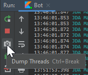
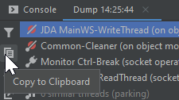

# Frequently Asked Questions

Didn't find an answer? Try asking in [our Discord server](https://discord.gg/0hMr4ce0tIl3SLv5)

??? question "What is a Guild?"

    In Discord API terminology a "Guild" is often used to refer to Discord servers with channels/roles/users

??? question "How do I make a bot account and add it to my server?"

    1. Create an application at: <https://discord.com/developers/applications/me>
    2. Create a bot account for that application
    3. Get the client id of your application
    4. Replace `CLIENT_ID` in this link: <https://discord.com/api/oauth2/authorize?scope=bot&client_id=CLIENT_ID>
    5. Open the link, select your server and authorize the bot

??? question "How do I connect my bot?"

    1. Before you can connect you need to create a bot account
    2. Get the **token** of your bot
    3. Create your main class in an already setup project with JDA
    4. Supply the token to your JDABuilder instance and build!
    ```java
    public static void main(String[] args) throws Exception
    {
        JDABuilder.createDefault(THE_TOKEN).build();
    }
    ```

??? question "Does this work with Kotlin?"

    Yes! This library makes use of the [JSR-305](https://www.cs.umd.edu/~pugh/JSR-305.pdf) annotations to be as compatible as possible with Kotlin.
    To be more idiomatic, you can use extensions like [JDA-KTX](https://github.com/MinnDevelopment/jda-ktx) and [JDA-reactor](https://github.com/MinnDevelopment/jda-reactor).

??? question "Why does method `XXX` not do anything? / What are RestActions?"

    When you use one of JDA's methods that interacts with Discord (like sending a message or retrieving data) and the method
    seems to have no effect (and no errors), chances are that you didn't use a RestAction properly or not at all.
    <br>You can read about what a RestAction is and how to use it in the [appropriate Wiki entry](../using-jda/using-restaction.md).

??? question "What is sharding?"

    When a bot reaches 2500 joined guilds, Discord will refuse to start a connection with it.
    <br>In order to connect bots of a size like that it has to **shard** the load. It is recommended to have 1000 guilds per shard.
    More information can be found in our [README](https://github.com/DV8FromTheWorld/JDA/tree/master/README.md).

??? question "How can I change the `Playing...`?"

    This is called a `Presence`and can be modified either before building JDA or at runtime.
    <br>When building you can do `JDABuilder.setActivity(Activity.playing("Thrones"))` and later change it using `JDA.getPresence().setActivity(...)`.
    In addition you may change the online status using `setStatus(OnlineStatus.INVISIBLE)` at the aforementioned locations.

    This may only be updated **5 times every 20 seconds** and all other updates will be silently dropped by Discord.

??? question "What is an Custom Emoji and Unicode Emoji?"

    While there are a lot of standardized emojis (defined through Unicode spec), Discord allows Guilds to add their own emojis to be available.
    Those custom emojis are not just a plain Unicode character, but rather their own entity with id, name, ...

    To make this distinction more clear, we refer to the standard (Unicode) emojis as `UnicodeEmoji` and the Discord entities as `CustomEmoji` in JDA.

    You can create instances of this for use in various methods, such as reactions, using the factory methods of the `Emoji` interface. For instance, to create a unicode emoji instance, you use `Emoji.fromUnicode("...")` with the string of **unicode characters**.

    To get the Unicode char(s) of some Emoji, you can either use a 3rd party library (such as [emoji-java](https://github.com/MinnDevelopment/emoji-java)) or just look them up online.
    You can add reactions with 3 different formats:

    ```java
    // custom
    message.addReaction(Emoji.fromFormatted("<:minn:245267426227388416>")).queue();
    // unicode escape
    message.addReaction(Emoji.fromUnicode("\uD83D\uDE02")).queue();
    // codepoint notation
    message.addReaction(Emoji.fromUnicode("U+1F602")).queue(); 
    ```

    - Custom Emoji (`<:name:id>`)
    - Unicode escape as UTF-16 characters (`\uXXXX\uXXXX`)
    - Codepoint Notation as UTF-32 characters (`U+XXXXXXXXU+XXXXXXXX`)

??? question "Why is there a warning from SLF4J when starting up?"

    As of JDA 3.3.1, we use SLF4J for message logging. This means that you have to manually add any suitable SLF4J implementation library to your project.

    If your project does not have a SLF4J implementation library, following warning will be shown on startup:
    ```
    SLF4J: Failed to load class "org.slf4j.impl.StaticLoggerBinder".
    SLF4J: Defaulting to no-operation (NOP) logger implementation
    SLF4J: See http://www.slf4j.org/codes.html#StaticLoggerBinder for further details.
    ```

    We currently provide a fallback implementation to not lose logging completely in this case. This fallback does not allow for a lot of configuration and we suggest using a proper implementation instead.

    I recommend [Logback](https://logback.qos.ch/). You can just add it to your Gradle/Maven file as extra dependency. There is a basic setup guide in our wiki available here: [Logging Setup](../setup/logging.md)

??? question "What is the best way to delete messages from history?"

    You can use [MessageChannel.getIterableHistory](https://ci.dv8tion.net/job/JDA/javadoc/net/dv8tion/jda/api/entities/MessageChannel.html#getIterableHistory()) to get an instance of [MessagePaginationAction](https://ci.dv8tion.net/job/JDA/javadoc/net/dv8tion/jda/api/requests/restaction/pagination/MessagePaginationAction.html) which can be used to load messages in various ways such as [takeAsync(amount)](https://ci.dv8tion.net/job/JDA/javadoc/net/dv8tion/jda/api/requests/restaction/pagination/PaginationAction.html#takeAsync(int)) or [takeUntilAsync(condition)](https://ci.dv8tion.net/job/JDA/javadoc/net/dv8tion/jda/api/requests/restaction/pagination/PaginationAction.html#takeUntilAsync(java.util.function.Predicate)). This can be combined with [MessageChannel.purgeMessages](https://ci.dv8tion.net/job/JDA/javadoc/net/dv8tion/jda/api/entities/MessageChannel.html#purgeMessages(java.util.List)) to bulk delete them from the channel. Keep in mind that `purgeMessages` will not delete all messages at once.

    !!! example "Examples"

        ```java
        // Delete a number of messages
        void deleteMessages(MessageChannel channel, int amount) {
        channel.getIterableHistory()
            .takeAsync(amount) // CompletableFuture<List<Message>>
            .thenAccept(channel::purgeMessages); // bulk deletes the messages from the channel (if possible)
        }

        // Delete messages up to the specified time
        void deleteUntil(MessageChannel channel, OffsetDateTime time) {
        channel.getIterableHistory()
            .takeUntilAsync(message -> message.getTimeCreated().isBefore(time)) // Collect messages until they pass the time condition
            .thenAccept(channel::purgeMessages); // bulk deletes the messages from the channel (if possible)
        }

        // Delete a number of messages for a specific author (this can be abstracted to any condition)
        void deleteFromUser(MessageChannel channel, User author, int amount) {
        List<Message> messages = new ArrayList<>(); // First create a list for your messages
        channel.getIterableHistory()
            .forEachAsync(m -> { // Loop over the history and filter messages
            if (m.getAuthor().equals(author)) messages.add(m); // Add these messages to a list (your collector)
            return messages.size() < amount; // keep going until limit is reached (might be smart to also have a time condition here)
            }) // This is also a CompletableFuture<Void> so you can chain a callback
            .thenRun(() -> channel.purgeMessages(messages)); // Run after loop is over, delete the messages in your list
        }
        ```

??? question "How can I send a message to a specific channel without an event?"

    Since you decided that you want to send a message to a specific channel you should already have either an **ID** or the **NAME and optionally GUILD (ID/NAME)** to locate this channel. Now all you need is access to the JDA instance of your bot session. This can easily be accomplished by passing the JDA instance as a parameter to the constructor of your class.

    With the JDA instance you can easily acquire the specific channel through your means. One example is the [getTextChannelById(id) method](https://ci.dv8tion.net/job/JDA/javadoc/net/dv8tion/jda/api/JDA.html#getTextChannelById(long)) and the other is the [getTextChannelsByName(name, true) method](https://ci.dv8tion.net/job/JDA/javadoc/net/dv8tion/jda/api/JDA.html#getTextChannelsByName(java.lang.String,boolean)). Note that names might not be unique to one channel (example "general") so the `getTextChannelsByName(...)` method returns a `List<TextChannel>` containing **all** matches for that specific name. If you desire a specific guild you can filter by first getting the guild via either [getGuildById(guildId)](https://ci.dv8tion.net/job/JDA/javadoc/net/dv8tion/jda/api/JDA.html#getGuildById(long)) or [getGuildsByName(guildName, true)](https://ci.dv8tion.net/job/JDA/javadoc/net/dv8tion/jda/api/JDA.html#getGuildsByName(java.lang.String,boolean)) and calling the same methods on the guilds rather than the JDA instance. It is not recommended to keep a reference to a Guild stored for long as the JDA cache might stop updating the specific instance in favor of a new one later on (for example when reconnecting).

    !!! example "Example - Handling the JDA instance"

        ```java
        public class EventChannel {
            private final JDA api;

            public EventChannel(JDA api) {
                this.api = api;
            }

            public void start() { ... }
        }
        ```

        Once you have this structure you have two choices of passing the JDA instance:

        === "Ready Event (recommended)"

            ```java
            public static void main(String[] args) {
                JDABuilder.createDefault(TOKEN)
                    .addEventListeners(listener) // some other listeners/settings
                    .addEventListeners(new ListenerAdapter() {
                        @Override public void onReady(ReadyEvent event) {
                            new EventChannel(event.getJDA()).start(); // starts your channel with the ready event
                        }
                    }).build();
            }
            ```

        === "Awaiting Ready"

            ```java
            public static void main(String[] args) {
                JDA api = JDABuilder.createDefault(TOKEN)
                    .addEventListeners(listener) // some other listeners/settings
                    .build();
                new EventChannel(api.awaitReady()).start();
            }
            ```

??? question "How can I wait for a user response?"

    Since JDA is event based you can implement a [finite state machine](https://en.wikipedia.org/wiki/Finite-state_machine).

    See my stackoverflow answers: 
    - [How to make a Discord Bot wait for a specific user to send a message with JDA?](https://stackoverflow.com/a/54492973/10630900)
    - [Repetitive Consumer For Loop](https://stackoverflow.com/a/56694065/10630900)

??? question "How can I find out which RestAction causes an ErrorResponseException?"

    ```java
    RestAction.setPassContext(true); // enable context by default
    RestAction.DEFAULT_FAILURE = Throwable::printStackTrace;
    ```

    Doing this will result in performance loss so it is recommended to only go to this extreme when you need to debug errors.
    To handle failures of a specific action, read this [RestAction queue returned failure](../using-jda/troubleshooting.md#restaction-queue-returned-failure).

??? question "How do I test other builds?"

    You can use JitPack to provide other branches of JDA as a dependency.  We have a tutorial on how to use it on [this wiki page](/using-jda/using-new-features).

??? question "How can I reduce the jar size of my bot?"

    To reduce the jar size of your bot you can either use Maven or Gradle. Alternatively use the minimized jar from the download server with the name `JDA-%VERSION%-withDependencies-min.jar`

    === "Gradle"

        1. Exclude OPUS natives if you don't need encoding/decoding of audio (With LavaPlayer you don't need these natives)
            ```groovy
            implementation("net.dv8tion:JDA:$VERSION") {
                exclude module: "opus-java"
            }
            ```
            For Kotlin DSL use `exclude(module="opus-java")`

        2. Minimize your Jar with the Shadow Plugin
            ```groovy
            shadowJar { minimize() }
            ```

    === "Maven"

        1. Exclude OPUS natives if you don't need encoding/decoding of audio (With LavaPlayer you don't need these natives)
                ```xml
                <dependency>
                    <groupId>net.dv8tion</groupId>
                    <artifactId>JDA</artifactId>
                    <version>$VERSION</version>
                    <exclusions>
                        <exclusion>
                            <groupId>club.minnced</groupId>
                            <artifactId>opus-java</artifactId>
                        </exclusion>
                    </exclusions>
                </dependency>
                ```

        2. Minimize your Jar using the shade plugin
            ```xml
            <plugin>
                <groupId>org.apache.maven.plugins</groupId>
                <artifactId>maven-shade-plugin</artifactId>
                <version>3.2.1</version>
                <configuration>
                    <minimizeJar>true</minimizeJar>
                </configuration>
                <executions>
                <execution>
                    <phase>package</phase>
                    <goals>
                    <goal>shade</goal>
                    </goals>
                </execution>
                </executions>
            </plugin>
            ```

??? question "How can I reduce the memory footprint of my bot?"

    The default behavior of JDA is to cache everything except for messages. However, the library user can choose to disable some parts of the cache to decrease the memory impact of the bot process in exchange for less context and possibly more garbage accumulation.

    As of JDA 4.2.0 we use 3 factory methods to build JDA instances.

    - `createDefault` - Enables cache for users who are active in voice channels and all cache flags
    - `createLight` - Disables all user cache and cache flags
    - `create` - Enables member chunking, caches all users, and enables all cache flags

    You can do more configuration manually though:

    1. Disable cache flags with `JDABuilder#disableCache(CacheFlag...)`
        <br>This will disable certain cached entities such as the presences (activities) of users or channel permission overrides for members.

    2. Enable lazy loading with `JDABuilder#setChunkingFilter(ChunkingFilter.NONE)`
        <br>This will only load members who actively participate in servers and not wait for users to load on startup.

    3. Disable Gateway Intents `JDABuilder#disabledIntents(EnumSet)`
        <br>This will disable unused events from being received such as GUILD_MESSAGES_TYPING or similar.

    4. Disable Member Cache `JDABuilder#setMemberCachePolicy(MemberCachePolicy)`
        <br>This will be used by JDA to decide whether to cache a member/user. You can use `NONE` to cache no users.

    5. Change the threading configuration with the pool setters:
        1. `JDABuilder#setCallbackPool(ExecutorService)`
        2. `JDABuilder#setGatewayPool(ScheduledExecutorService)`
        3. `JDABuilder#setRateLimitPool(ScheduledExecutorService)`

??? question "How do I make a thread dump?"

    The JDK provides a utility for creating a thread dump of a running JVM process: `jstack -l <pid>` (that's an L for "Long")
    Example: `jstack -l 1337 > dump.txt` This will list the thread dump and write it to a file called `dump.txt`.

    You can also create a thread dump directly in IntelliJ:

    

    

    This will copy the thread dump to your clipboard and you can save it to a text file.

