# Eclipse Setup

[  ](https://mvnrepository.com/artifact/net.dv8tion/JDA/latest)


=== "Gradle Setup"

    1. If you have *Eclipse IDE for Java Developers* installed, skip to **2.**, otherwise you need to install the *Buildship Gradle Integration plugin* first:
        1. Open up Eclipse and go to the Marketplace (located under the *Help* tab)
        1. Search for *"Gradle"* and install ***Buildship Gradle Integration*** ([Plugin-Page](http://marketplace.eclipse.org/content/buildship-gradle-integration))
        1. After the plugin is installed, relaunch Eclipse

    1. Right click within *Package/Project Explorer* and select **New > Other...**

        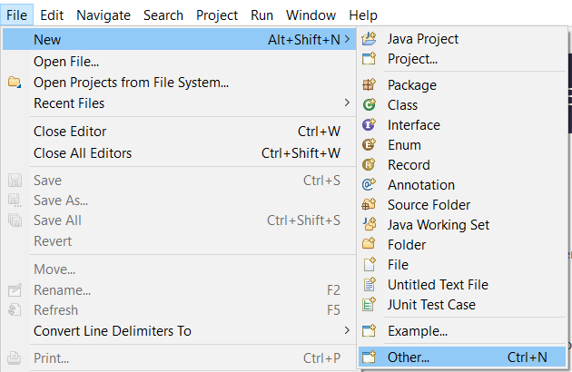

    1. In the *Gradle* folder, select **Gradle Project**

        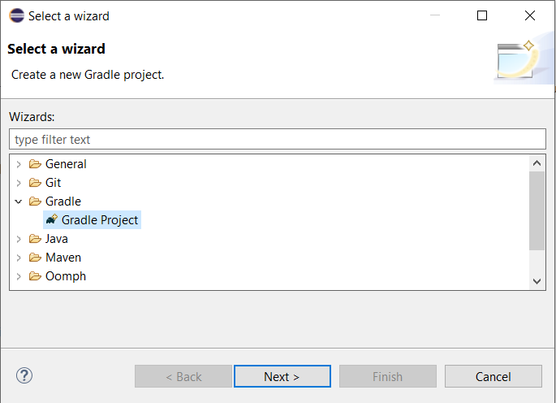

    1. Type a name for your Project and click on *Finish*. Your setup should look like this at this point:

        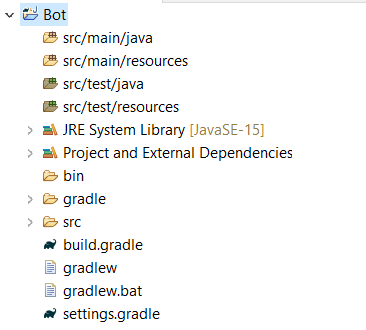

    1. Delete the classes within `src/main/java` and `src/test/java`

        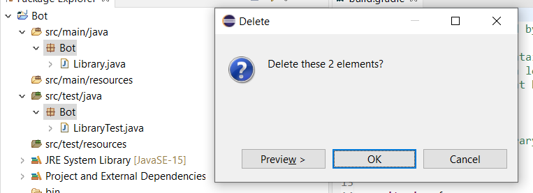

    1. Open up and edit the file `build.gradle`

        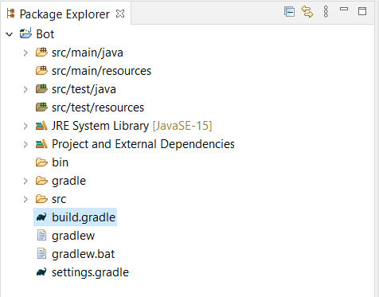

    1. Replace its content with the following code:

        ```groovy
        plugins {
            id("java")
            id("application")
            id("com.github.johnrengelman.shadow") version "6.0.0"
        }

        mainClassName = "com.example.jda.Bot"

        version '1.0'

        sourceCompatibility = 1.8

        repositories {
            mavenCentral()
        }

        dependencies {
            implementation("net.dv8tion:JDA:#.#.#_###")
        }

        compileJava.options.encoding = "UTF-8"
        ```

    1. Adjust the version of JDA you want to use (see dependencies-section of file) and fill in your Main-Class as soon as you have one (the one containing your `public static void main(String[] args)` method)
    1. Save the file and do the following: *Right click your project > Gradle > Refresh All*

        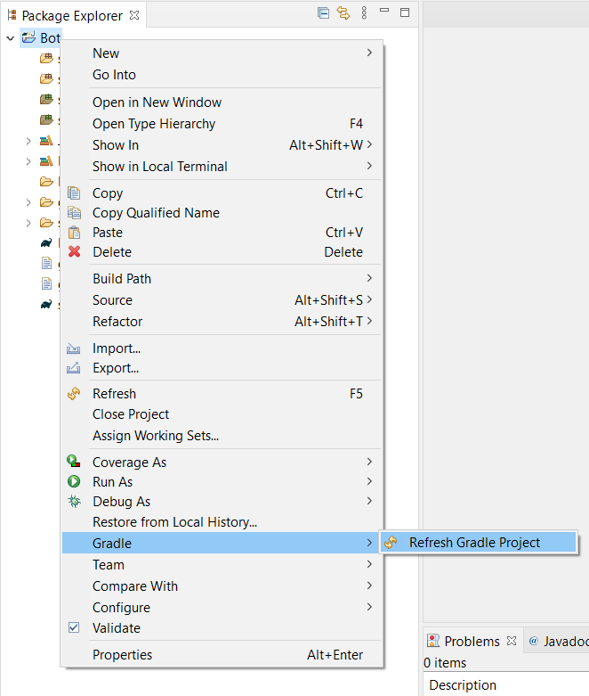

    1. Once all the dependencies have been downloaded, create your desired packages/classes in `src/main/java` and start coding!
    1. To build your project you can run `gradlew shadowJar` in a terminal of your project root, and it will produce a jar filled with your compiled code and JDA included in a single jar file! The jar can be found in `build/libs`
    1. [Setup Logback](./logging.md)
    1. Continue with [Getting Started](../using-jda/getting-started.md)


=== "Maven Setup"

    Prerequisites: Maven-Plugin and local Maven installation

    1. Create a new Maven project. (File -> New -> Other -> Maven -> Maven Project)

        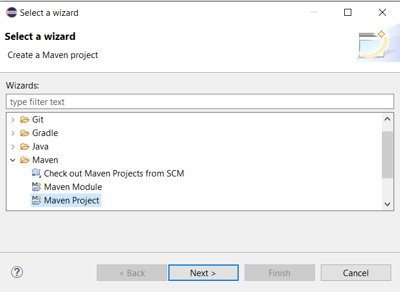

    1. Check the `Create a simple project` box on the next page as we don't need to worry about archetypes.

        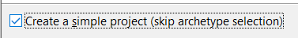

    1. Add a groupId, artifactId and a name. Make sure you try to follow the [naming conventions](https://maven.apache.org/guides/mini/guide-naming-conventions.html) while you are at this step. The result could look like the image below.

        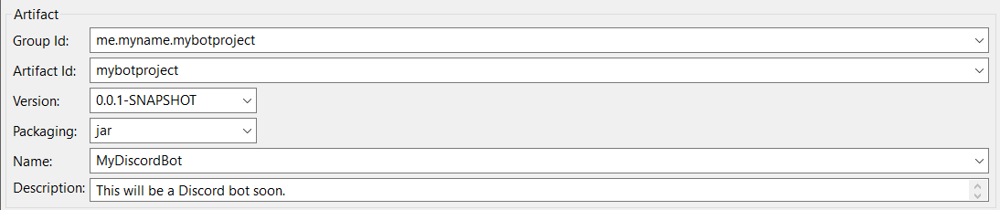

    1. Now let's start configuring it, first off, open up your pom.xml and add the following lines right after `</description>`
    ```xml
    <properties>
        <project.build.sourceEncoding>UTF-8</project.build.sourceEncoding>
        <project.reporting.outputEncoding>UTF-8</project.reporting.outputEncoding>
    </properties>
    ```
    - This will make your project support UTF-8 characters (So you can have it on Japanese servers for example) and also force Java 8, which is needed.

    1. Now, add the dependency, make sure you change `X.Y.Z-beta.W` to the latest version number (You can find it in the releases: https://github.com/DV8FromTheWorld/JDA/releases)
        ```xml
        <dependencies>
            <dependency>
            <groupId>net.dv8tion</groupId>
            <artifactId>JDA</artifactId>
            <version>X.Y.Z-beta.W</version>
            </dependency>
        </dependencies>
        ```

    1. Now you need to set up the (build) maven-shade and maven-compile plugins, add the following lines right after `</dependencies>`
        
        !!! note
            The following changes will force the compiler to use Java 8 (JDA needs it), so make sure you have it installed.

        ```xml
        <build>
            <plugins>
                <plugin>
                    <artifactId>maven-compiler-plugin</artifactId>
                    <version>3.8.1</version>
                    <configuration>
                        <source>1.8</source>
                        <target>1.8</target>
                    </configuration>
                </plugin>
                <plugin>
                    <artifactId>maven-shade-plugin</artifactId>
                    <version>3.2.4</version>
                    <configuration>
                        <transformers>
                            <transformer implementation="org.apache.maven.plugins.shade.resource.ManifestResourceTransformer">
                                <mainClass>YourMainClass</mainClass> <!-- (1) -->
                            </transformer>
                        </transformers>
                        <createDependencyReducedPom>false</createDependencyReducedPom>
                    </configuration>
                    <executions>
                        <execution>
                            <phase>package</phase>
                            <goals>
                                <goal>shade</goal>
                            </goals>
                        </execution>
                    </executions>
                </plugin>
            </plugins>
        </build>
        ```

        1. You have to replace this with a path to your main class like `me.myname.mybotproject.Main`

    1. After that, the project must be updated to download the dependencies. *Right click > Maven > Update Project*

        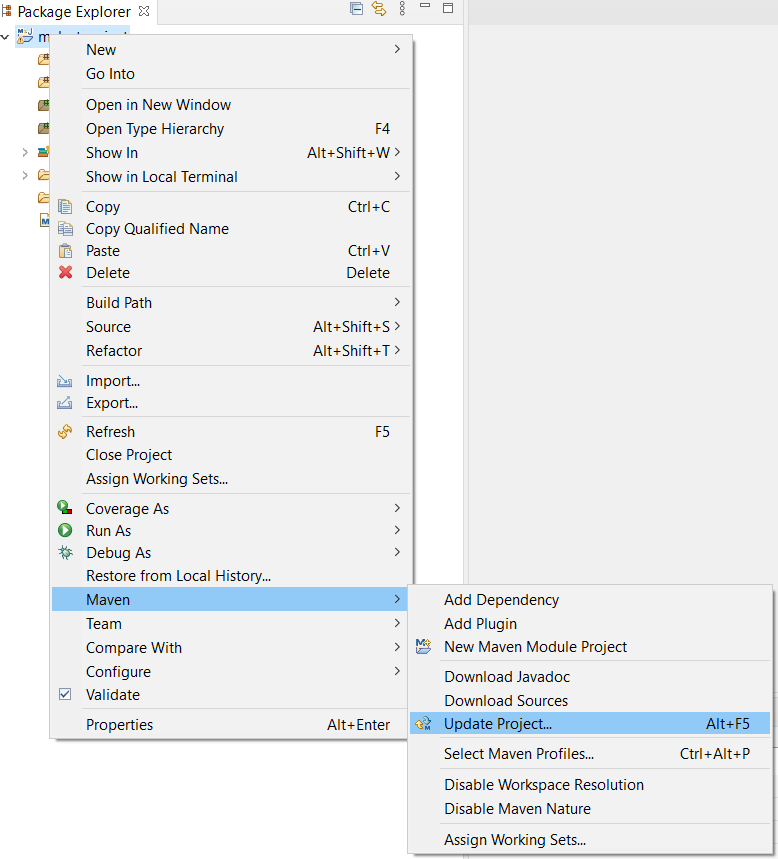  

    1. You are done! Now you can head to the [Javadocs](https://ci.dv8tion.net/job/JDA/javadoc/) or see examples at the [Examples](https://github.com/DV8FromTheWorld/JDA/tree/master/src/examples/java) page.
    1. [Setup Logback](./logging.md)
    1. Continue with [Getting Started](../using-jda/getting-started.md)


=== "Jar Setup"

    1. Download the latest (Binary) version of JDA (with Dependencies):
        - (Recommended) <https://github.com/DV8FromTheWorld/JDA/releases/>
        - (Latest/Dev) <https://ci.dv8tion.net/job/JDA5/>
    1. Create a new Java Project

        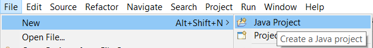

    1. Fill out the bot name, and set it to Java 8 (or above if available). This option might be set automatically when the `Use default location` box is checked.

        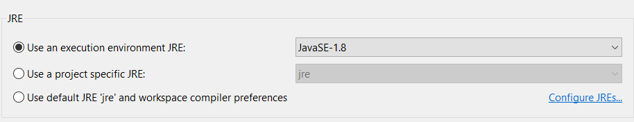

    1. Right click the project, go to **Properties**
    1. Click on **Java Build Path**, then click on **Libraries**, then on **Classpath**, **Add External JARs...**

        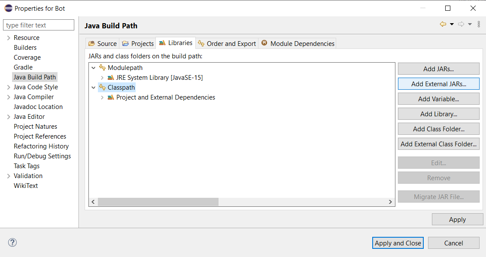

    1. Add your downloaded **JDA-withDependencies-x.x.x_xxx.jar** and expand its properties
    - If you don't want Javadoc and source annotations, skip to 11 (not recommended).

        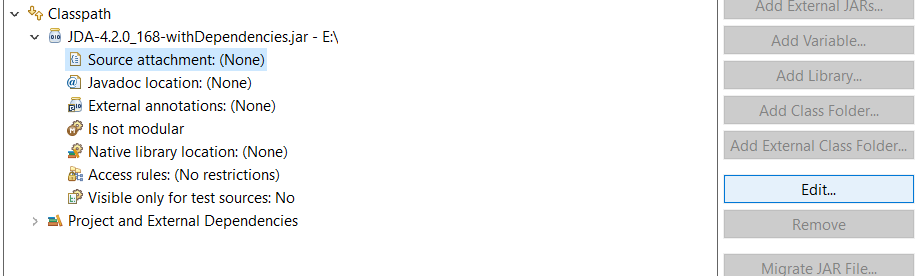

    1. Click on **Source Attachment**, then on **Edit...**, then mark **External Locations** and click on **External File**

        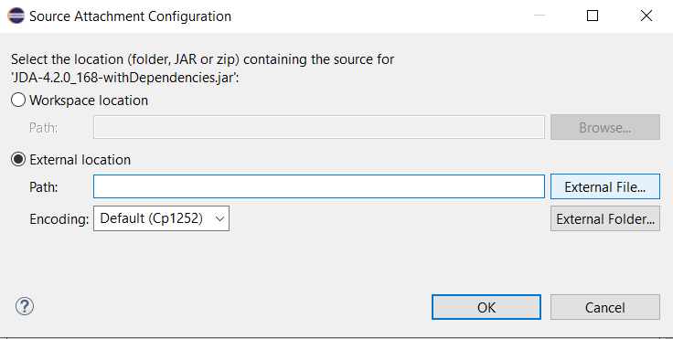

    1. Here, add your **JDA-x.x.x_xxx-sources.jar** and click on **OK**
    1. Next, click on **Javadoc Location**, then on **Edit...**, then mark **Javadoc in archive** and click on **Browse**

        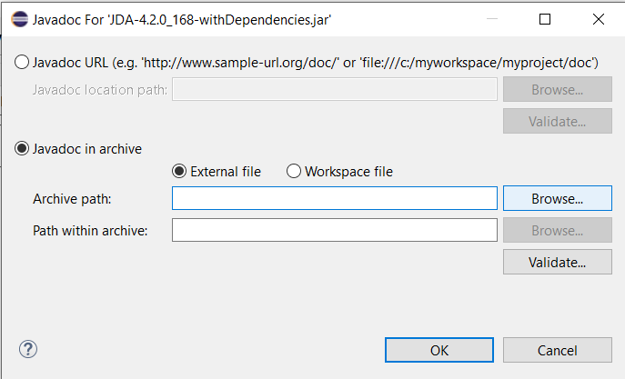

    1. Here, add your **JDA-x.y.z-www.p-javadoc.jar** and click on **OK**
    1. [Setup Logback](./logging.md)
    1. Continue with [Getting Started](../using-jda/getting-started.md)
