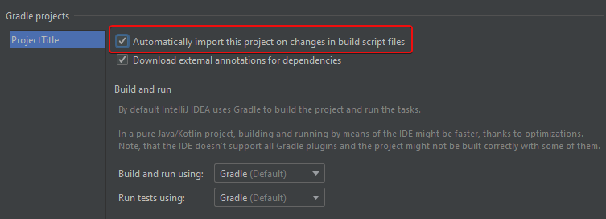
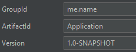

# IntelliJ IDEA Setup

[  ](https://mvnrepository.com/artifact/net.dv8tion/JDA/latest)

=== "Newer versions of IntelliJ IDEA"

    1. Navigate to "New Project" from any view
    1. Select Gradle -> Java as the type of Project and make sure the correct JDK is selected (Java 8 or higher)

        

    1. Provide a title for your project and define your GroupId and optionally the ArtifactId and initial Version in the "Artifact Coordinates" subsection

        

    1. Optionally enable Auto-Importing of the Gradle file in the Gradle settings. This is also the place where you could switch the runner for your project (By default, Gradle is used to run your application and tests)

        
        

    1. Let IntelliJ index your project.
    1. Open `build.gradle`
    1. Populate the build file with the following
        ```groovy
        plugins {
            id'application'
            id'com.github.johnrengelman.shadow' version '5.2.0'
        }
        
        mainClassName = 'com.example.jda.Bot' // (1)
        
        version '1.0'
        def jdaVersion = 'JDA_VERSION_HERE' // (2)
        
        sourceCompatibility = targetCompatibility = 1.8
        
        repositories {
            mavenCentral()
        }
        
        dependencies {
            implementation("net.dv8tion:JDA:$jdaVersion")
        }
        
        compileJava.options.encoding = 'UTF-8'
        ```
    
        1. Replace the `mainClassName` value with the path to your main class later on! 

        1. Replace the `JDA_VERSION_HERE` with the one mentioned in the [latest release](https://github.com/DV8FromTheWorld/JDA/releases/latest)

    1. If IntelliJ IDEA didn't already do so automatically, set up a source folder as `src/main/java`
    1. Create your group package. Example: `me.name.bot`
    1. Make your main class. Example: `Bot.java`.
        Your directory tree should look like this:
        ```
        ProjectName -> src/main/java -> me/name/bot -> Bot.java
                    -> gradle/wrapper -> gradle-wrapper.properties
                    -> gradle/wrapper -> gradle-wrapper.jar
                    -> build.gradle
                    -> settings.gradle
        ```
    1. Configure the `mainClassName` value in the `build.gradle` to your class. Example: `me.name.bot.Bot`
    1. To build your finished project simply use the `shadowJar` task in your Gradle tool window on right hand side of your editor. This will build a jar in `build/libs`. The one with the `-all` suffix is the shadow jar.
        > You can also run your project with the `run` Gradle task!
    1. [Setup Logback](./logging.md)
    1. Continue with [Getting Started](../using-jda/getting-started.md)


=== "Older versions of IntelliJ IDEA"

    1. Open the Project view
    1. Create a new Project

        

    1. Select `Gradle` > `Java`
    1. Configure your SDK to use Java 1.8

        

    1. Click `Next` and fill in your groupId and your artifactId. Example: `me.name` and `bot`

        

    1. Check `Use auto-import` and click `Next` > `Finish`

        
        
