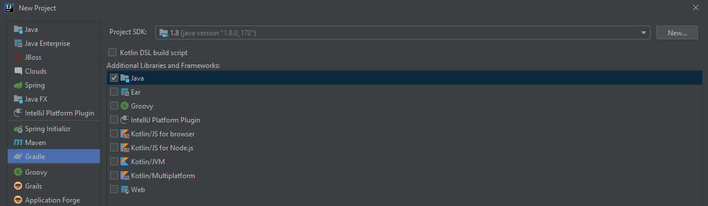
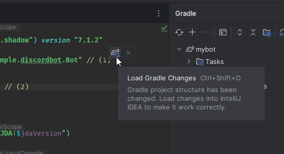
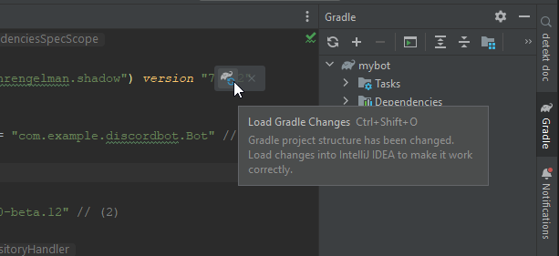

# IntelliJ IDEA Setup

[  ](https://mvnrepository.com/artifact/net.dv8tion/JDA/latest)

=== "New UI of IntelliJ IDEA"

    1. Navigate to "New Project" from any view
    1. Select Gradle -> Java as the type of Project and make sure the correct JDK is selected (Java 8 or higher)

        

    1. Let IntelliJ index your project.

        

    1. Open `build.gradle.kts`
    1. Populate the build file with the following
        ```kotlin
        plugins {
            application
            id("com.github.johnrengelman.shadow") version "7.1.2"
        }

        application.mainClass = "com.example.discordbot.Bot" // (1)
        group = "org.example"
        version = "1.0"

        val jdaVersion = "JDA_VERSION_HERE" // (2)

        repositories {
            mavenCentral()
        }

        dependencies {
            implementation("net.dv8tion:JDA:$jdaVersion")
        }

        tasks.withType<JavaCompile> {
            options.encoding = "UTF-8"
            options.isIncremental = true

            // Set this to the version of java you want to use,
            // the minimum required for JDA is 1.8
            sourceCompatibility = "1.8"
        }
        ```
    
        1. Replace the `mainClass` value with the path to your main class later on! 

        1. Replace the `JDA_VERSION_HERE` with the one mentioned in the [latest release](https://github.com/DV8FromTheWorld/JDA/releases/latest)

    1. Reload Gradle and wait for it to finish

        

    1. If IntelliJ IDEA didn't already do so automatically, set up a source folder as `src/main/java`
    1. Create your group package. Example: `com.example.discordbot`
    1. Make your main class. Example: `Bot.java`.
        Your directory tree should look like this:
        ```
        ProjectName -> src/main/java -> com/example/discordbot -> Bot.java
                    -> gradle/wrapper -> gradle-wrapper.properties
                    -> gradle/wrapper -> gradle-wrapper.jar
                    -> build.gradle.kts
                    -> settings.gradle.kts
        ```
    1. Configure the `mainClass` value in the `build.gradle.kts` to your class. Example: `com.example.discordbot.Bot`
    1. To build your finished project simply use the `shadowJar` task in your Gradle tool window on right hand side of your editor.
        > You can also run your project with the `run` Gradle task!

        
    
    1. This will build a jar in `build/libs`. The one with the `-all` suffix is the shadow jar.

        

    1. [Setup Logback](./logging.md)
    1. Continue with [Getting Started](../using-jda/getting-started.md)


=== "Older UI of IntelliJ IDEA"

    1. Navigate to "New Project" from any view
    1. Select Gradle -> Java as the type of Project and make sure the correct JDK is selected (Java 8 or higher)

        

    1. Let IntelliJ index your project.

        

    1. Open `build.gradle.kts`
    1. Populate the build file with the following
        ```kotlin
        plugins {
            application
            id("com.github.johnrengelman.shadow") version "7.1.2"
        }

        application.mainClass = "com.example.discordbot.Bot" // (1)
        group = "org.example"
        version = "1.0"

        val jdaVersion = "JDA_VERSION_HERE" // (2)

        repositories {
            mavenCentral()
        }

        dependencies {
            implementation("net.dv8tion:JDA:$jdaVersion")
        }

        tasks.withType<JavaCompile> {
            options.encoding = "UTF-8"
            options.isIncremental = true

            // Set this to the version of java you want to use,
            // the minimum required for JDA is 1.8
            sourceCompatibility = "1.8"
        }
        ```
    
        1. Replace the `mainClass` value with the path to your main class later on! 

        1. Replace the `JDA_VERSION_HERE` with the one mentioned in the [latest release](https://github.com/DV8FromTheWorld/JDA/releases/latest)

    1. Reload Gradle and wait for it to finish

        

    1. If IntelliJ IDEA didn't already do so automatically, set up a source folder as `src/main/java`
    1. Create your group package. Example: `com.example.discordbot`
    1. Make your main class. Example: `Bot.java`.
        Your directory tree should look like this:
        ```
        ProjectName -> src/main/java -> com/example/discordbot -> Bot.java
                    -> gradle/wrapper -> gradle-wrapper.properties
                    -> gradle/wrapper -> gradle-wrapper.jar
                    -> build.gradle.kts
                    -> settings.gradle.kts
        ```
    1. Configure the `mainClass` value in the `build.gradle.kts` to your class. Example: `com.example.discordbot.Bot`
    1. To build your finished project simply use the `shadowJar` task in your Gradle tool window on right hand side of your editor.
        > You can also run your project with the `run` Gradle task!

        

    1. This will build a jar in `build/libs`. The one with the `-all` suffix is the shadow jar.

        

    1. [Setup Logback](./logging.md)
    1. Continue with [Getting Started](../using-jda/getting-started.md)
        
