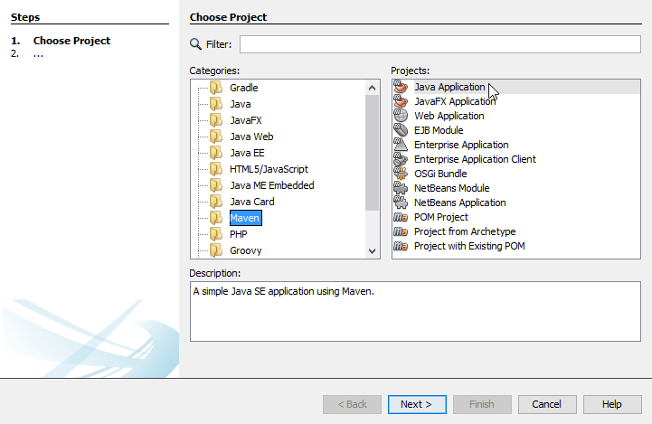
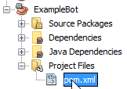
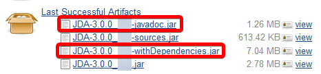
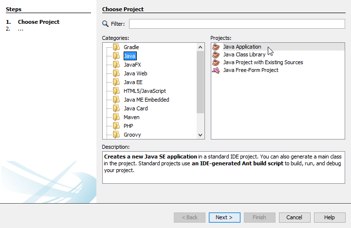
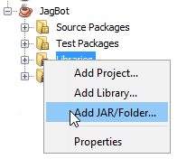
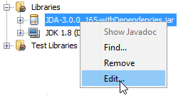
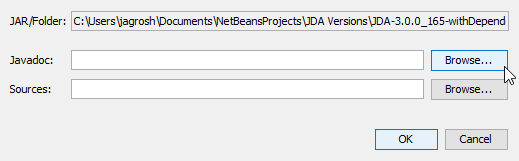

# Netbeans Setup

[  ](https://mvnrepository.com/artifact/net.dv8tion/JDA/latest)

=== "Maven Setup"

    1. **Make a new Maven Java Application**
        
        
    1. **Open up the pom.xml in the Project Files**
        
        
    1. **Add JDA as a dependency**

        !!! note inline end
            These can go anywhere within the `<project></project>` tags.

        ```xml
        <dependencies>
            <dependency>
                <groupId>net.dv8tion</groupId>
                <artifactId>JDA</artifactId>
                <version>5.0.0-beta.1</version>
            </dependency>
        </dependencies>
        ```
        

    1. [Setup Logback](./logging.md)

    1. Continue with [Getting Started](../using-jda/getting-started.md)

=== "Jar Setup"

    1. **Download the latest (binary) version of JDA (with dependencies), as well as the javadocs**
        
        - <https://ci.dv8tion.net/job/JDA5/>
        
        

    1. **Make a new Java Application**
        
        

    1. **Right-click the `Libraries` folder in your project, and select `Add JAR/Folder...`**
        
        

    1. **Find the `JDA...withDependencies.jar` and add it.**

    1. **Right-click on the newly-added Jar file, and select `Edit...`**
        
        

    1. **Select `Browse...` and add the javadoc jar**
        
        
    1. [Setup Logback](./logging.md)
    1. Continue with [Getting Started](../using-jda/getting-started.md)
