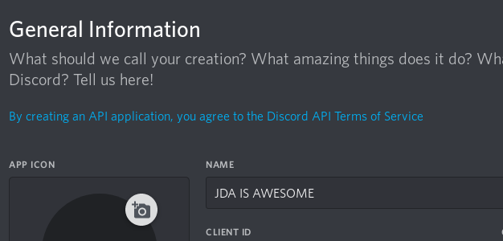
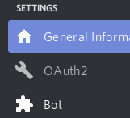
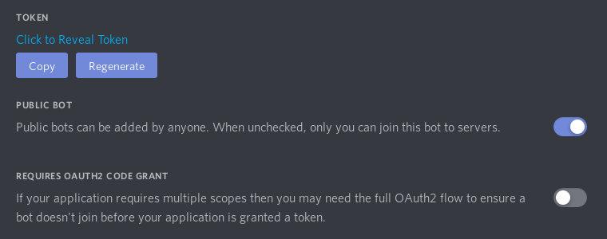
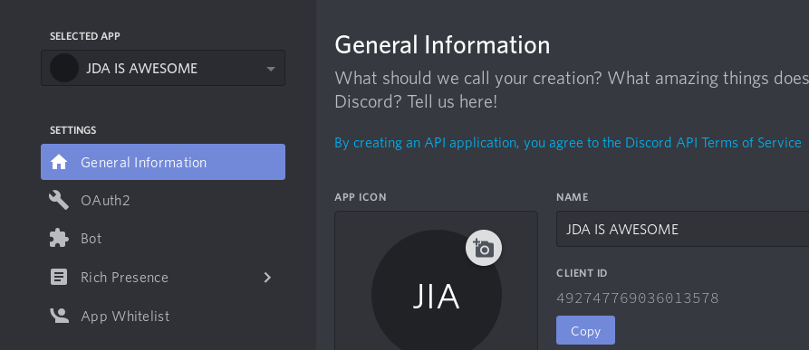
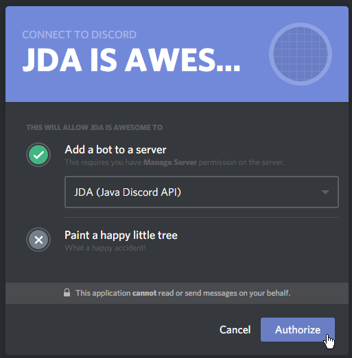
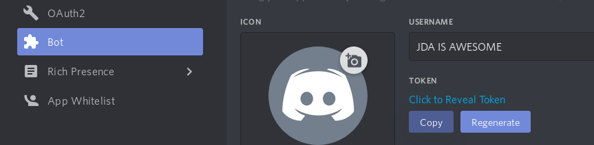

# Making a Ping-Pong Bot

## Creating a Discord Bot

1. Go to <https://discord.com/developers/applications>
2. Create an Application
3. Give the application an awesome name (this will be used as the bots initial username)
    
    

4. Click **Save Changes**
5. Open the **Bot** tab
    
    

6. Make sure to make your bot public, this allows others to invite your bot to your server.

    

    You only want require code grant enabled if you plan to use an oauth2 flow, the general user will not need this.

## Add your Discord Bot to a Server

1. Retrieve your application/client ID from the **General Information** tab
    
    

2. Create an OAuth2 authorization URL (reference [docs](https://discord.com/developers/docs/topics/oauth2#bot-authorization-flow)).
    Users who want to use Interaction Commands should also add the `applications.commands` scope.
    Some example URLs:
      - `https://discord.com/api/oauth2/authorize?client_id=492747769036013578&scope=bot`
      - `https://discord.com/api/oauth2/authorize?client_id=492747769036013578&scope=bot+applications.commands`

    !!! note 
        This can be done from the **Bot** tab at the very bottom. Here you can select the scope **bot** and some permissions required for your bots functionality (optional).

3. Open the authorization dialogue (click link from step 2)
4. Select your Server (Requires permission to manage server)
5. Click **Authorize**
    
    

## Connecting to Discord with a Bot Account

1. Retrieve your **Bot Token** from your application dashboard (https://discord.com/developers/applications)
    
    
    
    !!! caution
        Note that it is very important not to show this token to anyone, ever.

2. Set up your JDA project: 
    - [IntelliJ IDEA](../setup/intellij.md)
    - [Eclipse](../setup/eclipse.md)
    - [Netbeans](../setup/netbeans.md)
    
    [  ](https://ci.dv8tion.net/job/JDA5/lastSuccessfulBuild/)

3. Create [`JDABuilder`](https://ci.dv8tion.net/job/JDA5/javadoc/net/dv8tion/jda/api/JDABuilder.html) instance with token
4. Build JDA using `JDABuilder.build()`
    
    ```java
    public static void main(String[] arguments) throws Exception
    {
        JDA api = JDABuilder.createDefault(BOT_TOKEN).build();
    }
    ```
    !!! tip
        It is often better to load your token in from an external file or environment variable, especially if you plan on publishing the source code.

## Making a Ping-Pong Protocol

1. Setup your JDA instance (see [Connecting To Discord](#connecting-to-discord-with-a-bot-account))
2. Implement an `EventListener` or extend `ListenerAdapter`

    ```java
    public class MyListener extends ListenerAdapter 
    {
        @Override
        public void onMessageReceived(MessageReceivedEvent event)
        {
            if (event.getAuthor().isBot()) return;
            // We don't want to respond to other bot accounts, including ourself
            Message message = event.getMessage();
            String content = message.getContentRaw(); 
            // getContentRaw() is an atomic getter
            // getContentDisplay() is a lazy getter which modifies the content for e.g. console view (strip discord formatting)
            if (content.equals("!ping"))
            {
                MessageChannel channel = event.getChannel();
                channel.sendMessage("Pong!").queue(); // Important to call .queue() on the RestAction returned by sendMessage(...)
            }
        }
    }
    ```
    !!! info
        More information about RestActions can be found [here](using-restaction.md)


3. Register your listener with either `JDABuilder.addEventListeners(new MyListener())` or `JDA.addEventListeners(new MyListener())` (see [Events](../introduction/events.md))
