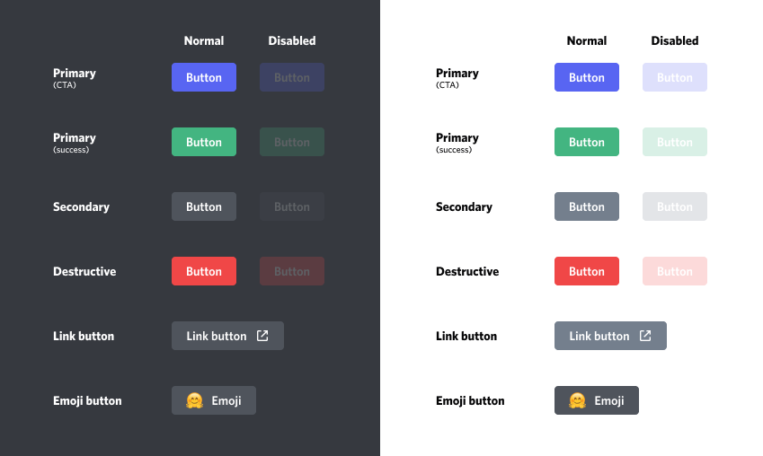

# Interactions

!!! note ""

    Interactions differ between JDA v4 and JDA v5.  This page covers JDA v5.

This guide will give you a brief introduction to an API for adding and handling interactions in Discord. Interactions are a way to integrate your bot features directly into the Discord User Interface. These things include features such as:

- [Slash Commands](#slash-commands)
- [Slash Command Autocomplete](#slash-command-autocomplete)
- [Context Menus](#context-menus)
- [Buttons](#buttons)
- [Select Menus (Dropdowns)](#select-menus-dropdowns)
- [Modals](#modals)

### Ephemeral Messages

Ephemeral messages are only visible to the user who used your Interaction. They are similar to the messages Discord sends you when you update your nickname with `/nick`.

There are many limitations to ephemeral messages, a few of which are listed below:

- Cannot be reacted to
- Cannot be retrieved
- Will be removed after a client restart

!!! example

    

You can only create ephemeral messages with interactions. For example with `deferReply(true)`, `reply(content).setEphemeral(true)`, or `getHook().sendMessage(content).setEphemeral(true)`. For convenience, you can also configure the `InteractionHook` to default to ephemeral messages with `hook.setEphemeral(true)`.

## Command Interactions

### Slash Commands

A slash command is something you might already be familiar with from the olden times of Discord. Commands such as `/shrug` or `/me` have existed for quite a long time. With Slash Command interactions you can now make your very own commands like this! But these commands come with some limitations, which I have explained in this gist: [Slash Command Limitations](https://gist.github.com/MinnDevelopment/b883b078fdb69d0e568249cc8bf37fe9)


All of these commands are used through the interactions API. They do not require the user to send an actual message in the channel and you don't have to do string parsing either.

To create commands you need to make some API requests. There are 2 types of commands you can create called **global commands** and **guild commands**.

- **Global**: These commands are available in every server your bot is in (regardless of sharding!) and direct message (Private Channels).
- **Guild**: These commands are only in the specific guild that you created them in and cannot be used in direct messages.

#### Creating Slash Commands

You can create commands through these methods in JDA:

- `updateCommands()`
- `upsertCommand(name, description)`

!!! example
    === "Java"
        ```java
        guild.updateCommands().addCommands(
                Commands.slash("echo", "Repeats messages back to you.")
                    .addOption(OptionType.STRING, "message", "The message to repeat.")
                    .addOption(OptionType.INTEGER, "times", "The number of times to repeat the message.")
                    .addOption(OptionType.BOOLEAN, "ephemeral", "Whether or not the message should be sent as an ephemeral message."),
                Commands.slash("animal", "Finds a random animal")
                     .addOptions(
                         new OptionData(OptionType.STRING, "type", "The type of animal to find")
                             .addChoice("Bird", "bird")
                             .addChoice("Big Cat", "bigcat")
                             .addChoice("Canine", "canine")
                             .addChoice("Fish", "fish")
                     )
        ).queue();
        ```
    === "Kotlin"
        ```kotlin
        guild.updateCommands().addCommands(
                Commands.slash("echo", "Repeats messages back to you.")
                    .addOption(OptionType.STRING, "message", "The message to repeat.")
                    .addOption(OptionType.INTEGER, "times", "The number of times to repeat the message.")
                    .addOption(OptionType.BOOLEAN, "ephemeral", "Whether or not the message should be sent as an ephemeral message."),
                Commands.slash("animal", "Finds a random animal")
                     .addOptions(
                         OptionData(OptionType.STRING, "type", "The type of animal to find")
                             .addChoice("Bird", "bird")
                             .addChoice("Big Cat", "bigcat")
                             .addChoice("Canine", "canine")
                             .addChoice("Fish", "fish")
                     )
        ).queue()
        ```

You need to call these on a `JDA` instance to create global commands, and on a `Guild` instance to create guild commands . Your bot needs the `applications.commands` scope in addition to the `bot` scope for your bot invite link. Example: <https://discord.com/oauth2/authorize?client_id=123456789&scope=bot+applications.commands>

!!! warning

    If the `applications.commands` scope is not present, JDA will fail to create guild commands, and global commands will not be shown in the client.

Once a command is created, it will continue persisting even when your bot restarts. Commands stay until the bot is either kicked or your bot explicitly deletes the command. **You don't need to create your commands every time your bot starts!**

#### Responding to Slash Commands

When a user tries to use one of your commands you will receive a `SlashCommandInteractionEvent`. This event needs to be handled by your event listener.
The flow of a slash command response is as follows:

1. Acknowledge the command

    This means you need to either **reply** or **deferReply**. You only have ***3 SECONDS*** to acknowledge a command.
    Since some commands may take longer than 3 seconds you may want to use `deferReply` to have more time for handling. This will instead send a `Thinking...` message to channel which is later updated by a followup message (see step 2).

    

2. Send followup messages

    Sometimes commands need more than one response. However, you can only send one initial reply to a command. To send additional messages for the same slash command you need to use the `InteractionHook` attached to the event with `getHook()`. This is a **webhook** that allows you to send additional messages for up to 15 minutes after the initial command.

When you use `deferReply` the first message sent to this webhook will act identically to using `editOriginal(...)`. The message you send is also referred to as *deferred reply* in this case. Your deferred reply will **edit** your initial `Thinking...` message instead of sending an additional message to channel. This means you cannot use `setEphemeral` on this deferred reply since you already decided whether the message will be ephemeral through your initial acknowledgment.

!!! example "Example Reply"
    === "Java"
        ```java
        public class SayCommand extends ListenerAdapter {
            @Override
            public void onSlashCommandInteraction(SlashCommandInteractionEvent event) {
                if (event.getName().equals("say")) {
                  event.reply(event.getOption("content").getAsString()).queue(); // reply immediately
                }
            }
        }
        ```
    === "Kotlin"
        ```kotlin
        object SayCommand : ListenerAdapter() {
          override fun onSlashCommandInteraction(event: SlashCommandInteractionEvent) {
            if (event.name == "say") {
              event.reply(event.getOption("content")!!.asString).queue()
            }
          }
        }
        ```


!!! example "Example Deferred Reply"

    === "Java"
        ```java
        public class TagCommand extends ListenerAdapter {
          @Override
          public void onSlashCommandInteraction(SlashCommandInteractionEvent event) {
            if (event.getName().equals("tag")) {
              event.deferReply().queue(); // Tell discord we received the command, send a thinking... message to the user
              String tagName = event.getOption("name").getAsString();
              TagDatabase.fingTag(tagName,
                (tag) -> event.getHook().sendMessage(tag).queue() // delayed response updates our inital "thinking..." message with the tag value
              );
            }
          }
        }
        ```
    === "Kotlin"
        ```kotlin
        object TagCommand : ListenerAdapter() {
            override fun onSlashCommandInteraction(event: SlashCommandInteractionEvent) {
                if (event.name == "tag") {
                    event.deferReply().queue() // Tell discord we received the command, send a thinking... message to the user
                    val tagName = event.getOption("name")!!.asString
                    TagDatabase.fingTag(tagName) { tag ->
                        event.hook.sendMessage(tag).queue() // delayed response updates our inital "thinking..." message with the tag value
                    }
                }
            }
        }
        ```

#### Managing Slash Command Permissions

Restricting slash commands to specific roles or members is up to the admins of the guild.  However, bots can specify a set of permissions that sets who can use those commands by default.

Note that members with `Permission.ADMINISTRATOR` can always use commands, and they can override which roles or members can run the command.  JDA only changes the _default_ members and roles that can access it.

In order to set this default, `.setDefaultPermissions()` can be called on the command before you register it. 
`DefaultMemberPermissions.DISABLED` can be used to only allow administrators by default, and `DefaultMemberPermissions.ENABLED` can be used to allow all members by default.

!!! example
    This will restrict the command so that only members with the `Permission.MANAGE_CHANNEL` and `Permission.MODERATE_MEMBERS` permissions can use the command:
    === "Java"
        ```java
        guild.updateCommands().addCommands(
            Commands.slash("meeting", "Creates a new channel for an emergency meeting")
                .setDefaultPermissions(DefaultMemberPermissions.enabledFor(Permission.MANAGE_CHANNEL, Permission.MODERATE_MEMBERS))
        ).queue();
        ```
    === "Kotlin"
        ```java
        guild.updateCommands().addCommands(
            Commands.slash("meeting", "Creates a new channel for an emergency meeting")
                .setDefaultPermissions(DefaultMemberPermissions.enabledFor(Permission.MANAGE_CHANNEL, Permission.MODERATE_MEMBERS))
        ).queue()
        ```


### Slash Command Autocomplete

Slash command autocompletion is a feature that allows users to begin typing arguments to a command, and suggestions from the bot will be displayed to the user, in-client.

Any slash command arguments using the `String`, `Integer` or `Number` types can be autocompleted.  By default, options are not autocompleted.  In order to make an option autocompleted, `OptionData#setAutoComplete(true)` may be used.


#### Handling Autocomplete

As the user is typing an argument that has autocomplete enabled for it, the bot will receive an `CommandAutoCompleteInteractionEvent`.
This event isn't fired for each keystroke, but is sent when Discord determines the user has paused typing for a bit.

Autocompletions can suggest up to 25 options, and users do not have to send a command with one of the options.

!!! example
    Creating the command:
    === "Java"
        ```java
        guild.updateCommands().addCommands(
                Commands.slash("fruit", "find a given fruit")
                    .addOption(OptionType.STRING, "name", "fruit to find", true, true)
        ).queue();
        ```    
    === "Kotlin"
        ```java
        guild.updateCommands().addCommands(
                Commands.slash("fruit", "find a given fruit")
                    .addOption(OptionType.STRING, "name", "fruit to find", required=true, autocomplete=true)
        ).queue()
        ```
    Handling the event:
    === "Java"
        
        ```java title="AutoCompleteBot.java"
        public class AutoCompleteBot extends ListenerAdapter {
            private String[] words = new String[]{"apple", "apricot", "banana", "cherry", "coconut", "cranberry"};
    
            @Override
            public void onCommandAutoCompleteInteraction(CommandAutoCompleteInteractionEvent event) {
                if (event.getName().equals("fruit") && event.getFocusedOption().getName().equals("name")) {
                    List<Command.Choice> options = Stream.of(words)
                            .filter(word -> word.startsWith(event.getFocusedOption().getValue())) // only display words that start with the user's current input
                            .map(word -> new Command.Choice(word, word)) // map the words to choices
                            .collect(Collectors.toList());
                    event.replyChoices(options).queue();
                }
            }
        }
        ```
    === "Kotlin"
        ```kotlin title="AutoCompleteBot.kt"
        object AutoCompleteBot : ListenerAdapter() {
            private val words = arrayOf("apple", "apricot", "banana", "cherry", "coconut", "cranberry")
            
            override fun onCommandAutoCompleteInteraction(event: CommandAutoCompleteInteractionEvent) {
                if (event.name == "fruit" && event.focusedOption.name == "name") {
                    event.replyChoiceStrings(words.filter {
                        it.startsWith(event.focusedOption.value)
                    }).queue()
                }
            }
        }
        ```


### Context Menus

Context Menu commands are a special type of command that can be invoked on a user or message by right-clicking on them.
These commands take no arguments, and are useful for providing a quick way to perform actions on a user or message.


!!! example

    Creating the commands:
    ```java
    guild.updateCommands().addCommands(
            Commands.context(Command.Type.USER, "Get user avatar"),
            Commands.message("Count words")
    ).queue()
    ```
    
    Handling the events:
    === "Java"
        ```java title="ContextMenuBot.java"
        public class ContextMenuBot extends ListenerAdapter {
            @Override
            public void onUserContextInteraction(UserContextInteractionEvent event) {
                if (event.getName().equals("Get user avatar")) {
                    event.reply("Avatar: " + event.getTarget().getEffectiveAvatarUrl()).queue();
                }
            }
        
            @Override
            public void onMessageContextInteraction(MessageContextInteractionEvent event) {
                if (event.getName().equals("Count words")) {
                    event.reply("Words: " + event.getTarget().getContentRaw().split("\\s+").length).queue();
                }
            }
        }
        ```
    === "Kotlin"
        ```kotlin title="ContextMenuBot.kt"
        object ContextMenuBot : ListenerAdapter() {
            override fun onUserContextInteraction(event: UserContextInteractionEvent) {
                if (event.name == "Get user avatar") {
                    event.reply("Avatar: " + event.target.effectiveAvatarUrl).queue()
                }
            }
        
            override fun onMessageContextInteraction(event: MessageContextInteractionEvent) {
                if (event.name == "Count words") {
                    event.reply("Words: " + event.target.contentRaw.split(Regex("\\s+")).size).queue()
                }
            }
        }
        ```


## Component Interactions

To add components to a message you can use up to 5 ActionRows.

You can add multiple ActionRows with either `setComponents` or `addComponents`.
For the common case of a single ActionRow you can also use `setActionRow(Component...)` or `addActionRow(Component...)`.

Each ActionRow can hold up to a certain amount of components:

- 5 Buttons
- 1 Select Menu (Dropdown)
- 1 Text Input (Restricted to Modals)

These component interactions offer 4 response types:

- Reply
- Deferred Reply
- Edit Message
- Deferred Edit Message

The reply and deferred reply responses are identical to the Slash-Commands response types. However, these new edit response types are used to update the existing message the component is attached to. If you just want to acknowledge that the component was successfully interacted with, you can simply call `deferEdit()` without any further updates, which will prevent the interaction from failing on the user side.

To properly use an interactive component, you need to use the **Component ID** (aka **Custom ID**).
This ID can also be used to then *identify* which component was pressed by the user.

Such Component ID is provided by `getComponentId()` on every Component Interaction.

Keep in mind that these Component IDs **must be unique across all components in one message**.

### Buttons

Each button can be enabled or disabled, have a specific style, label, and emoji:



#### Handling ButtonInteractionEvent

When a user presses one of these buttons, you will receive a `ButtonInteractionEvent` for the respective interaction.

Each non-link button requires such an ID in order to be used.

!!! example

    === "Java"
        ```java
        public class HelloBot extends ListenerAdapter {
            @Override
            public void onSlashCommandInteraction(SlashCommandInteractionEvent event) {
                if (event.getName().equals("hello")) {
                    event.reply("Click the button to say hello")
                        .addActionRow(
                          Button.primary("hello", "Click Me"), // Button with only a label
                          Button.success("emoji", Emoji.fromFormatted("<:minn:245267426227388416>"))) // Button with only an emoji
                        .queue();
                } else if (event.getName().equals("info")) {
                    event.reply("Click the buttons for more info")
                        .addActionRow( // link buttons don't send events, they just open a link in the browser when clicked
                            Button.link("https://github.com/DV8FromTheWorld/JDA", "GitHub")
                              .withEmoji(Emoji.fromFormatted("<:github:849286315580719104>")), // Link Button with label and emoji
                            Button.link("https://ci.dv8tion.net/job/JDA/javadoc/", "Javadocs")) // Link Button with only a label
                        .queue();
                }
            }
            
            @Override
            public void onButtonInteraction(ButtonInteractionEvent event) {
                if (event.getComponentId().equals("hello")) {
                    event.reply("Hello :)").queue(); // send a message in the channel
                } else if (event.getComponentId().equals("emoji")) {
                    event.editMessage("That button didn't say click me").queue(); // update the message
                }
            }
        }
        ```
    === "Kotlin"
        ```kotlin
        object HelloBot: ListenerAdapter() {
            override fun onSlashCommandInteraction(event: SlashCommandInteractionEvent) {
                if (event.name == "hello") {
                    event.reply("Click the button to say hello")
                        .addActionRow(
                            Button.primary("hello", "Click Me"),  // Button with only a label
                            Button.success("emoji", Emoji.fromFormatted("<:minn:245267426227388416>"))) // Button with only an emoji
                        .queue()
                } else if (event.name == "info") {
                    event.reply("Click the buttons for more info")
                        .addActionRow( // link buttons don't send events, they just open a link in the browser when clicked
                            Button.link("https://github.com/DV8FromTheWorld/JDA", "GitHub")
                                .withEmoji(Emoji.fromFormatted("<:github:849286315580719104>")),  // Link Button with label and emoji
                            Button.link("https://ci.dv8tion.net/job/JDA/javadoc/", "Javadocs")) // Link Button with only a label
                        .queue()
                }
            }
        
            override fun onButtonInteraction(event: ButtonInteractionEvent) {
                when (event.componentId) {
                    "hello" -> event.reply("Hello :)").queue() // send a message in the channel
                    "emoji" -> event.editMessage("That button didn't say click me").queue() // update the message
                }
            }
        }
        ```

### Select Menus (Dropdowns)

Select Menus can be disabled.

It's possible to set the minimum and maximum number of options to be selected.

There are two implementations for SelectMenus:

- [`StringSelectMenu`](#string-select-menus) supports custom string choices
- [`EntitySelectMenu`](#entity-select-menus) derives its choices from mentionable entities (such as `User`s, `Channel`s, etc)

#### String Select Menus

String Select Menus support up to 25 options.

Each option can have its own label, description, and emoji.
There can be multiple options selected and set as default.


#### Entity Select Menus

Entity Select Menus do not support custom choices. Instead, they derive their choices from mentionable Discord entities
such as `User`s, `Channel`s, etc.


You can specify which entity types you wish to appear as choices by specifying the `SelectTarget`s in `EntitySelectMenu.create`. If you create an entity select menu with channel type targets, the same menu may not utilize user or role select targets, and vice versa.

You can limit channel selections to specific channel types by using the `setChannelTypes` method on `EntitySelectMenu.Builder`.

!!! info

    These Select Menus do not support setting a custom list of options or customizing the appearance in any way. They always show the complete list of possible entities for the specified types.

#### Handling Select Menus

When a user selects their options from a dropdown and submits their choices, you will receive either one of the following for the respective interaction:

- A `StringSelectInteractionEvent` for a String Select Menu interaction
- An `EntitySelectInteractionEvent` for an Entity Select Menu interaction

Both interaction events provide the values that were selected by the user.

!!! example "Example String Select Handling"
    === "Java"
        ```java
        public class StringDropdownBot extends ListenerAdapter {
            @Override
            public void onSlashCommandInteraction(SlashCommandInteractionEvent event) {
                if (event.getName().equals("food")) {
                    event.reply("Choose your favorite food")
                        .addActionRow(
                            StringSelectMenu.create("choose-food")
                              .addOption("Pizza", "pizza", "Classic") // SelectOption with only the label, value, and description
                              .addOptions(SelectOption.of("Hamburger", "hamburger") // another way to create a SelectOption
                                    .withDescription("Tasty") // this time with a description
                                    .withEmoji(Emoji.fromUnicode("\uD83C\uDF54")) // and an emoji
                                    .withDefault(true)) // while also being the default option
                            .build())
                        .queue();
                }
            }

            @Override
            public void onStringSelectInteraction(StringSelectInteractionEvent event) {
                if (event.getComponentId().equals("choose-food")) {
                    event.reply("You chose " + event.getValues().get(0)).queue();
                }
            }
        }
        ```
    === "Kotlin"
        ```kotlin
        object StringDropdownBot : ListenerAdapter() {
            override fun onSlashCommandInteraction(event: SlashCommandInteractionEvent) {
                if (event.name == "food") {
                    val selectMenu = StringSelectMenu.create("choose-food")
                        .addOption("Pizza", "pizza", "Classic") // SelectOption with only the label, value, and description
                        .addOptions(SelectOption.of("Hamburger", "hamburger") // another way to create a SelectOption
                            .withDescription("Tasty") // this time with a description
                            .withEmoji(Emoji.fromUnicode("\uD83C\uDF54")) // and an emoji
                            .withDefault(true)) // while also being the default option
                        .build()
                    
                    event.reply("Choose your favorite food")
                        .addActionRow(selectMenu)
                        .queue()
                }
            }
        
            override fun onStringSelectInteraction(event: StringSelectInteractionEvent) {
                if (event.componentId == "choose-food") {
                    event.reply("You chose " + event.values[0]).queue()
                }
            }
        }
        ```

!!! example "Example Entity Select Handling"
    === "Java"
        ```java
        public class EntityDropdownBot extends ListenerAdapter {
            @Override
            public void onSlashCommandInteraction(SlashCommandInteractionEvent event) {
                if (event.getName().equals("highfive")) {
                    event.reply("Choose the user to high-five")
                        .addActionRow(
                            EntitySelectMenu.create("choose-user", SelectTarget.USER)
                            .build())
                        .queue();
                }
            }

            @Override
            public void onEntitySelectInteraction(EntitySelectInteractionEvent event) {
                if (event.getComponentId().equals("choose-user")) {
                    // Mentions provide the selected values using familiar getters
                    List<User> users = event.getMentions().getUsers();
                    event.reply("You high-fived " + users.get(0).getAsMention()).queue();
                }
            }
        }
        ```
    === "Kotlin"
        ```kotlin
        object EntityDropdownBot : ListenerAdapter() {
            override fun onSlashCommandInteraction(event: SlashCommandInteractionEvent) {
                if (event.name == "food") {
                    val selectMenu = EntitySelectMenu.create("choose-user", SelectTarget.USER)
                        .build()
                    
                    event.reply("Choose the user to high-five")
                        .addActionRow(selectMenu)
                        .queue()
                }
            }
        
            override fun onEntitySelectInteraction(event: EntitySelectInteractionEvent) {
                if (event.componentId == "choose-user") {
                    // Mentions provide the selected values using familiar getters
                    val users = event.mentions.users;
                    event.reply("You high-fived " + users.first().asMention).queue()
                }
            }
        }
        ```

## Modals

Modals are pop-ups that appear in a user's Discord client.


Similarly to messages, Modals can contain up to **5** ActionRows, although the only component that can be put inside Modals at the moment (`TextInput`) takes up a whole ActionRow. 

### Replying with a Modal

!!! example
    === "Java"
        ```java
        public class SupportCommand extends ListenerAdapter {
            @Override
            public void onSlashCommandInteraction(SlashCommandInteractionEvent event) {
                if (event.getName().equals("modmail")) {
                    TextInput subject = TextInput.create("subject", "Subject", TextInputStyle.SHORT)
                            .setPlaceholder("Subject of this ticket")
                            .setMinLength(10)
                            .setMaxLength(100) // or setRequiredRange(10, 100)
                            .build();

                    TextInput body = TextInput.create("body", "Body", TextInputStyle.PARAGRAPH)
                            .setPlaceholder("Your concerns go here")
                            .setMinLength(30)
                            .setMaxLength(1000)
                            .build();

                    Modal modal = Modal.create("modmail", "Modmail")
                            .addComponents(ActionRow.of(subject), ActionRow.of(body))
                            .build();

                    event.replyModal(modal).queue();
                }
            }
        }
        ```
    === "Kotlin"
        ```kotlin
        object SupportCommand : ListenerAdapter() {
            override fun onSlashCommandInteraction(event: SlashCommandInteractionEvent) {
                if (event.name == "modmail") {
                    val subject = TextInput.create("subject", "Subject", TextInputStyle.SHORT)
                        .setPlaceholder("Subject of this ticket")
                        .setMinLength(10)
                        .setMaxLength(100) // or setRequiredRange(10, 100)
                        .build()

                    val body = TextInput.create("body", "Body", TextInputStyle.PARAGRAPH)
                        .setPlaceholder("Your concerns go here")
                        .setMinLength(30)
                        .setMaxLength(1000)
                        .build()

                    val modal = Modal.create("modmail", "Modmail")
                        .addComponents(ActionRow.of(subject), ActionRow.of(body))
                        .build()

                    event.replyModal(modal).queue()
                }
            }
        }
        ```

### Handling ModalInteractionEvent

When the user clicks the "Submit" button on the Modal, you will receive an `ModalInteractionEvent`, containing all the values the user put in it.

!!! warning

    Acknowledging a `ModalInteractionEvent` is necessary. Failing to respond to the event will not close it on the user's client, and will show them an error.

!!! info

    If the Modal originated from a Component-Interaction (Buttons, SelectMenus), it is possible to acknowledge the interaction using an edit to the original Message using `editMessage()` or similar.

!!! example
    === "Java"
        ```java
        public class ModalListener extends ListenerAdapter {
            @Override
            public void onModalInteraction(@Nonnull ModalInteractionEvent event) {
                if (event.getModalId().equals("modmail")) {
                    String subject = event.getValue("subject").getAsString();
                    String body = event.getValue("body").getAsString();

                    createSupportTicket(subject, body);

                    event.reply("Thanks for your request!").setEphemeral(true).queue();
                }
            }
        }
        ```
    === "Kotlin"
        ```kotlin
        object ModalListener : ListenerAdapter() {
            override fun onModalInteraction(event: ModalInteractionEvent) {
                if (event.modalId == "modmail") {
                    val subject = event.getValue("subject") ?: return
                    val body = event.getValue("body") ?: return

                    createSupportTicket(subject, body)

                    event.reply("Thanks for your request!").setEphemeral(true).queue()
                }
            }
        }
        ```
