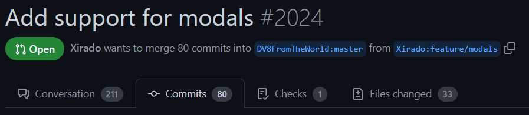

# Using New Features

When contributors are making new features, like introducing modals, 
you might be interested in trying out or testing these features before they get released.

## Using [JitPack](https://jitpack.io)

Using JitPack, you can get a build of any fork of JDA, on any branch, on any commit.
It is still highly recommended that you use a build tool such as [Gradle](https://gradle.org) or [Maven](https://maven.apache.org).

### Getting the Necessary Info

Let's take the [PR for the Discord modals](https://github.com/DV8FromTheWorld/JDA/pull/2024) as an example.

{width="720"}

You will need the author's name, which here is `xirado`.

### Getting the Latest Version

Next, head to the `Commits` tab.

{width="720"}

You can now scroll down to the bottom, as to find the latest **commit hash**.  It should look like this:

{width="720"}

Here you can see the 7 first characters of the latest commit are `36eea2a`.

### Putting It Together

So far we have:

* PR author name: `xirado`
* Version (7 character commit hash): `36eea2a`

You can now add the dependency to your project using your favorite build tool, but don't forget to remove your current JDA dependency first.

Template:
=== "Gradle"

    ```groovy
    repositories {
        mavenCentral()
        maven { url 'https://jitpack.io' }
    }

    dependencies {
        implementation("com.github.AuthorName:JDA:CommitHash")
    }
    ```

=== "Maven"

    Put this in your `<repositories>` tag    

    ```xml
    <repository>
        <id>jitpack</id>
        <url>https://jitpack.io</url>
    </repository>
    ```

    and then this, in your `<dependencies>` tag

    ```xml
    <dependency>
        <groupId>com.github.AuthorName</groupId>
        <artifactId>JDA</artifactId>
        <version>CommitHash</version>
    </dependency>
    ```

With our example:
=== "Gradle"

    ```groovy
    repositories {
        mavenCentral()
        maven { url 'https://jitpack.io' }
    }

    dependencies {
        implementation("com.github.xirado:JDA:36eea2a")
    }
    ```

=== "Maven"

    Put this in your `<repositories>` tag    

    ```xml
    <repository>
        <id>jitpack</id>
        <url>https://jitpack.io</url>
    </repository>
    ```

    and then this, in your `<dependencies>` tag

    ```xml
    <dependency>
        <groupId>com.github.xirado</groupId>
        <artifactId>JDA</artifactId>
        <version>36eea2a</version>
    </dependency>
    ```