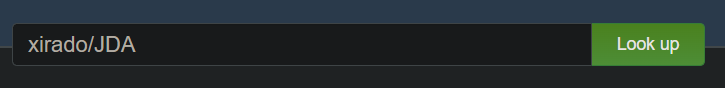
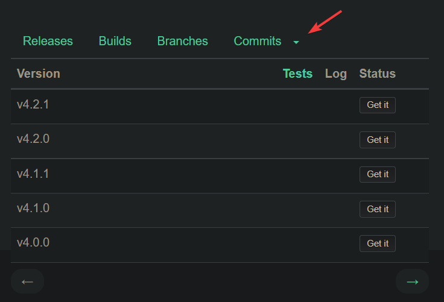
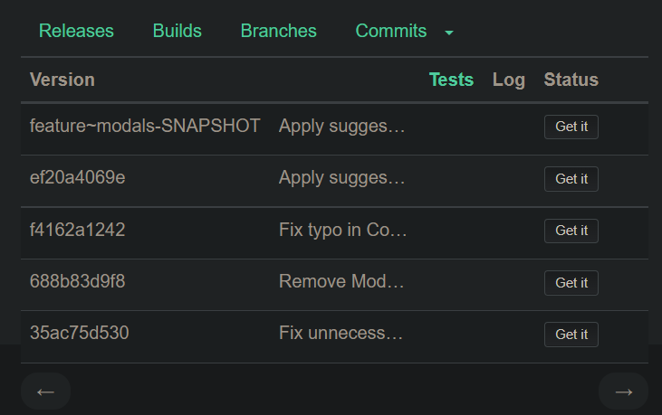

# Using new features

When contributors are making new features, for example, introducing modals, 
you might be interested in trying these features before they get released and/or test them.

## Using [JitPack](https://jitpack.io)

Using JitPack, you can get a build of any fork of JDA, on any branch, on any commit.
Of course, it is highly recommended that you use a build tool such as [Gradle](https://gradle.org) or [Maven](https://maven.apache.org)

### Getting the necessary info

Let's take the [PR for the Discord modals](https://github.com/DV8FromTheWorld/JDA/pull/2024) as an example

{width="720"}

Here the important part is `from Xirado:feature/modals`

* `Xirado` is the owner of the repository
* `feature/modals` is the branch name of the PR

### Going to JitPack

You then want to go to the [JitPack website](https://jitpack.io/) and enter `OwnerName/RepositoryName`, which here it would be `xirado/JDA` (Owner name on JitPack is case-insensitive)

{width="480"}

Upon clicking `Look up`, you'll see something like this appear

{width="480"}

You have to then click the arrow, and select the branch you want, here we'll choose the `feature/modals` branch, you should have something like that

{width="480"}

You can then pick the version that's second from top to bottom, so here it would be `ef20a4069e`, this is the **commit hash**

### Putting it together

So far we got:

* Owner name: `xirado`
* Version (commit hash): `ef20a4069e`

You can now add the dependency to your favorite build tool, but before that you will have to remove your current JDA dependency

=== "Maven"

    Put this in your `<repositories>` tag    

    ```xml
    <repository>
        <id>jitpack</id>
        <url>https://jitpack.io</url>
    </repository>
    ```

    and then this, in your `<dependencies>` tag

    ```xml
    <dependency>
        <groupId>com.github.OwnerName</groupId>
        <artifactId>JDA</artifactId>
        <version>CommitHash</version>
    </dependency>
    ```

=== "Gradle"
    
    ```groovy
    repositories {
        mavenCentral()
        maven { url 'https://jitpack.io' }
    }
    dependencies {
        implementation("com.github.OwnerName:JDA:CommitHash")
    }
    ```